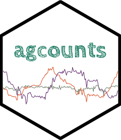

# agcounts 

<!-- badges: start -->
[](https://CRAN.R-project.org/package=agcounts)
[](https://github.com/bhelsel/agcounts/actions/workflows/R-CMD-check.yaml)
[](https://app.codecov.io/gh/bhelsel/agcounts?branch=master)
<!-- badges: end -->


### Background

The use of portable accelerometers for the assessment of physical activity in
free-living individuals has increased exponentially since the introduction of
this technique in the early 1980’s (Montoye et al., 1983; Troiano et al., 2008,
2014). Over the past ~40 years, data collection and processing protocols have
been refined (Troiano, 2023). The ActiGraph (ActiGraph LLC, Pensacola, FL) is
among the most widely used accelerometers in physical activity and health
research (Wijndaele et al., 2015). The 2022 release of the ActiGraph count
algorithm (Neishabouri et al.) <a href =
https://www.nature.com/articles/s41598-022-16003-x>"Quantification of
Acceleration as Activity Counts in ActiGraph Wearables"</a>, and accompanying
Python package improved the transparency and interpretation of accelerometer
device-measured physical activity. However, not all users are comfortable with
the Python language.


### What the Package Does

This R Package is a translation of ActiGraph’s Python package, with additional
extensions to make data processing easier and faster for end users.

Key functionalities and extensions include:  
  1) Automation and partial runtime optimization of the count algorithm; 
  2) Visualization tools (plots and tables) to enhance program useability; 
  3) Accessibility and usability for individuals without programming experience. 

The package reads the X, Y, and Z axes in a gt3x accelerometer file and converts it to Actigraphy counts. 


### Getting Started

Use of the package requires R (version 4.2.2 or greater recommended), with
`devtools` and `agcounts` installed and ActiGraph data file of type ".gt3x".

We suggest the following workflow:
  
  1) [Install the `agcounts` Package](/README.md#install-the-agcounts-package)
  2) [Review and Set Parameters for Processing gt3x files](/README.md#review-and-set-parameters)
  3) [Read Files](/README.md#reading-files)
  4) [Calculate Counts](/README.md#calculate-counts)
  5) [Write Output](/README.md#writing-files)


### Install the `agcounts` Package
```r
# Install the devtools package if it is not already installed
install.packages("devtools")

# Use the `install_github` function to download agcounts from GitHub
devtools::install_github("bhelsel/agcounts")
```


### Review and Set Parameters

The `agcounts` package includes a Shiny app to assist the user with fine tuning
parameters such as epoch length. When first analyzing a data set, we suggest a
user experienced with Actilife or ActiGraph data view a data set with the Shiny
app, `agcountsShinyDeployApp`. The Shiny app is useful for visualizing the data
and dynamically experimenting with setting various processing parameters that
affect activity counts in subsequent steps. Users may also wish to compare
`agcounts` processing to Actilife using the Shiny app. The Shiny App does not
output processed data.
```r
#Launch the Shiny app.
agcounts::agcountsShinyApp()
```
Use of the `agcountsShinyDeployApp` is relatively self explanatory but does
require familiarity with analysis of gt3x files. Use and interpretation of gt3x
files is beyond the scope of this README file. The app is dynamic to provide
realtime decision making regarding parameters. After identifying appropriate
parameters to suit project needs, users will use the [R command
line](/README.md#reading-files) to fully process and output data.


### Reading Files

#### Read in raw acceleration data and calculate ActiGraph counts

There are 3 ways to read in raw acceleration data using the `agcounts` package.
This is done by the `parser` argument from the `agread` function. This is an
exported function from the `agcounts` package but the user can also choose to
access `agread` via the `get_counts` function to read the data and calculate 
counts. The preferred `parser` method is to use the calibrated reader from 
ActiGraph's <a href = https://github.com/actigraph/pygt3x>pygt3x</a> Python 
module. This requires the user to ensure that Python version ≥ 3.8 is installed. 
We recommend the user load the `reticulate` package to install python and the 
pygt3x module by following these steps.

```r

library(reticulate)

# Install miniconda and restart your R session
reticulate::install_miniconda()

# Run py_config() to ensure that you have a python version available
# This will also initialize the r-reticulate virtual environment
py_config()

# Install pygt3x from Gitub using pip
py_install("pygt3x", pip = TRUE)

# Check to see if the pygt3x installation worked
py_list_packages()

```

You can also choose to use the `GGIR` parser from the <a
href=https://github.com/wadpac/GGIR>GGIR</a> package. No additional
configuration is needed except for ensuring the GGIR package is installed.
Currently, this is the slowest way to calibrate data but can handle
non-ActiGraph files. Finally, the `read.gt3x` parser can be used to read in data
using the <a href=https://github.com/THLfi/read.gt3x>read.gt3x</a> package. If
the user is working with an ActiGraph device, we have also included a C++
version of the `GGIR` parser that offers calibration at an improved speed.


### Calculate Counts
`calculate_counts` is the main function in the `agcounts` package.

#### Read and Convert a single gt3x file to ActiGraph counts
```r
# path = "Full pathname to the gt3x file", e.g.:

path = system.file("extdata/example.gt3x", package = "agcounts")

# Ensure that the r-reticulate virtual environment has been activated.
# This may not be necessary based on your Python configuration and how you installed the python packages.

reticulate::use_virtualenv("r-reticulate")

library(agcounts)

# Using the default pygt3x reader because pygt3x is installed
epochs_pygt3x <- 
  agread(path, parser = "pygt3x") %>%
  calculate_counts(epoch = 60)
  
# GGIR calibrated reader
epochs_ggir <- 
  agread(path, parser = "GGIR") %>%
  calculate_counts(epoch = 60)
  
# GGIR C++ calibrated reader
epochs_agcalibrate <-
  agread(path, parser = "read.gt3x") %>%
  agcalibrate() %>%
  calculate_counts(epoch = 60)
  
# read.gt3x R package
epochs_read_gt3x <-
  agread(path, parser = "read.gt3x") %>%
  calculate_counts(epoch = 60)
```


### Get Counts

The `get_counts` function is the wrapper function for `calculate_counts` that
also reads in the data using `agread` and one of the listed methods. 

```r
path = system.file("extdata/example.gt3x", package = "agcounts")
get_counts(path = path, epoch = 60, write.file = FALSE, return.data = TRUE, parser = "pygt3x")
```


### Writing Files

#### Read and convert a single gt3x file to ActiGraph counts exported to a csv file

We also offer a `write.file` argument that will read, convert, and export the
ActiGraph count data to a csv file in the same directory.

```r
# path = "Full pathname to the gt3x file", e.g.:
path = system.file("extdata/example.gt3x", package = "agcounts")

get_counts(path = path, epoch = 60, write.file = TRUE, return.data = FALSE, parser = "pygt3x")
```

#### Read and convert multiple gt3x files to ActiGraph counts exported a csv file

We can extend the `write.file` argument by passing the path name of several gt3x
files to an `apply` function.

```r
folder = "Full pathname to the folder where the gt3x files are stored"

files = list.files(path = folder, pattern = ".gt3x", full.names = TRUE)

sapply(files, get_counts, epoch = 60, write.file = TRUE, return.data = FALSE, parser = "pygt3x")
```

To speed up processing time, the parallel package may be a useful addition to
the `write.file` argument. Here is sample code that can be adjusted based on 
each user's computer and R configurations.

```r
folder = "Full pathname to the folder where the gt3x files are stored"

files = list.files(path = folder, pattern = ".gt3x", full.names = TRUE)

cores = parallel::detectCores()

Ncores = cores - 1

cl = parallel::makeCluster(Ncores)

doParallel::registerDoParallel(cl)

`%dopar%` = foreach::`%dopar%`

foreach::foreach(i = files, .packages = "agcounts") %dopar% {
  get_counts(path = i, epoch = 60, write.file = TRUE, return.data = FALSE, parser = "pygt3x")
}

parallel::stopCluster(cl)

```


### References

Montoye, H. J., Washburn, R., Servais, S., Ertl, A., Webster, J. G., & Nagle, F.
J. (1983). Estimation of energy expenditure by a portable accelerometer [Journal
Article]. Med Sci Sports Exerc, 15(5), 403–407.

Neishabouri, A., Nguyen, J., Samuelsson, J., Guthrie, T., Biggs, M., Wyatt, J.,
Cross, D., Karas, M., Migueles, J. H., Khan, S., & Guo, C. C. (2022).
Quantification of acceleration as activity counts in ActiGraph wearable [Journal
Article]. Sci Rep, 12(1), 11958. https://doi.org/10.1038/s41598-022-16003-x

Troiano, R. P. (2023). Evolution of public health physical activity applications
of accelerometers: A personal perspective [Journal Article]. Journal for the
Measurement of Physical Behaviour, 6(1), 13–18.

Troiano, R. P., Berrigan, D., Dodd, K. W., Mâsse, L. C., Tilert, T., & McDowell,
M. (2008). Physical activity in the united states measured by accelerometer
[Journal Article]. Med Sci Sports Exerc, 40(1), 181–188.
https://doi.org/10.1249/mss.0b013e31815a51b3

Troiano, R. P., McClain, J. J., Brychta, R. J., & Chen, K. Y. (2014). Evolution
of accelerometer methods for physical activity research [Journal Article]. Br J
Sports Med, 48(13), 1019–1023. https://doi.org/10.1136/bjsports-2014-093546


### Help and Package Maintenance

The package was created and is maintained by Dr. Brian Helsel
bhelsel_at_kumc.edu using R version 4.2.2. Forward compatibility is a goal but
cannot be guaranteed. Backward compatibility is not guaranteed. Brian welcomes
suggested changes through the GitHub "Issues" functionality. Collaborative
inquires are welcome via email.
